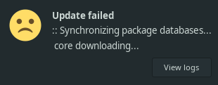
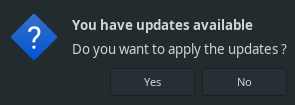

# Scripts

Welcome on this repository!

This repo contains some scripts that can be usefull.

## Input asker

**filename**: `scripts/graphic_input_asker.sh`

### Dependencies

- [TK](https://www.tcl.tk/software/tcltk/), already installed on most of unix-based systems.

Works on every unix-based systems and should works on windows.

### Description

This script provide a graphical window to ask text input form the user.

The user is able to hide/show the text he is entering, so you can use this as a passwork asker too.  
You can customize the window title.  
The script will output the text entered by the user so you can capture it.

##### Arguments

- `$@` : The script will use all the arguments passed as the window title if any, concatenated with a space between.

### Usage examples

```sh
echo "Please enter the text you want to print"
input=$(<yourPath>/graphic_input_asker.sh)
echo "You just entered the following text: $input"
```

## Update with notifications

**filename**: `scripts/update.sh`  

### Dependencies

- **Password asker**, to ask sudo password graphically, you can use [input asker script](#input-asker).
- **[Terminator](https://terminator-gtk3.readthedocs.io/en/latest/)**, used as default terminal.
- **[vi](https://fr.wikipedia.org/wiki/Vi)**, used as default visual, already installed on most of unix-based systems.
- **`notify-send` binary**, used to send desktop graphic notifications.

**This script only works on arch-based linux os**.

### Description

This script adds an overlay to have notifications when updating your system.

When the system update is finished, you will receive a notification marked as critical, so it will not automatically disappear, making you are sure not to miss it.  
The notifications looks like the following




The `view logs` button when the update fail allows you to view the logs produced when updating the system, so you could watch the reason why the update failed.  
The log will be displayed using the binary defined by the `$VISUAL` env var or `vi`(or `nvim`) if this env var is not provided.  
This binary will be launched through the terminal emulator defined by the `$TERMINAL` env var or `terminator` if this env var is not provided.

##### Arguments

This script use sudo with -A, so you should define, either in your evn variables or in your `sudo.conf`, the `askpass binary path`, for example:
```
Path askpass /home/curs3w4ll/.local/etc/graphic_input_asker.sh
```

You can define the terminal you want to use to see the logs by setting the `$TERMINAL` env var.

You can define the editor you want to use to see the logs file by setting the `$VISUAL` env var or by passing its path as first argument of the script.

### Usage examples

```sh
./update_script.sh
```

```sh
./update_script.sh code
```

You can use the script as an item in you panel bar.

## Update detector

**filename**: `scripts/checkupdates.sh`

### Dependencies

- **[Update script](#update-with-notifications)**, to update your system.
- **`notify-send` binary**, used to send desktop graphic notifications.

**This script only works on arch-based linux os**.

### Description

This script detect if you have available updates to install on your system.

It will detect if you have available updates and ask by a notification you if you want to do them.  
The notification looks like the following



If you click on the `Yes` button, it will start the [update script](#update-with-notifications).  
If you click on the `No` button, it will not do the updates and you will not be asked again until you restart your system (or remove the files in `/tmp`).

##### Arguments

All the arguments passed to this script are optional and if any, they will all be passed to the update script.

### Usage examples

```zshrc
export VISUAL=nvim

nohup $HOME/.local/etc/checkupdates_script.sh 2>/dev/null > /dev/null </dev/null &
disown
clear
```

Adding this on top of your zshrc will check if you have any update each time you start a new zsh session (a new terminal for example).
<!-- Template: -->
<!-- ##  -->
<!--  -->
<!-- **filename**: `` -->
<!--  -->
<!-- ### Dependencies -->
<!--  -->
<!--  -->
<!-- ### Description -->
<!--  -->
<!--  -->
<!-- ##### Arguments -->
<!--  -->
<!-- ### Usage examples -->
<!--  -->
<!-- ```sh -->
<!-- ``` -->
